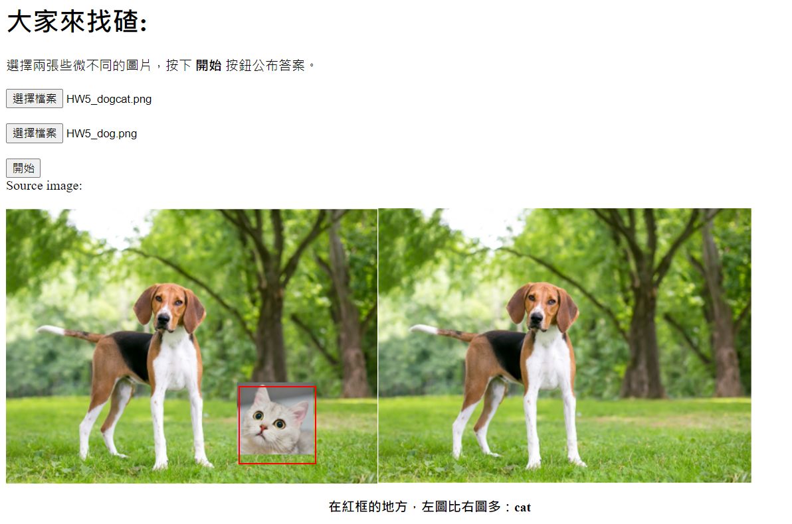

# 大家來找碴
### 功能說明
1.動機目的：本次作業希望模擬讓孩童在玩'大家來找碴'時，除了訓練孩童的專注力，也能幫助孩童學習些許英文單字  

2.功能原理：輸入兩張僅有一處不同的圖，並將兩張圖交由Azure電腦視覺偵測物件，其所偵測的標籤在兩張圖之間理應只會落差一個。再透過兩者比較輸出多出來的物件英文，並使用紅框將其位置框選出來，以達到與使用者互動的功能。   

3.功能限制：兩張圖的不同為增加一物，辨別的物件不能太小。   

4.額外問題：相同的圖片Azure回傳的標籤可能不同(如下圖)。   

  

   

   
相同的鳥，一個是'bird'，一個是'lovebird'

### 程式碼
本次作業除了main.js，index.html也有稍微更改。   

[main.js](https://github.com/mlchung1231/LATrepo/blob/main/week13/Homework5/main.js)   

[index.html](https://github.com/mlchung1231/LATrepo/blob/main/week13/Homework5/index.html)

